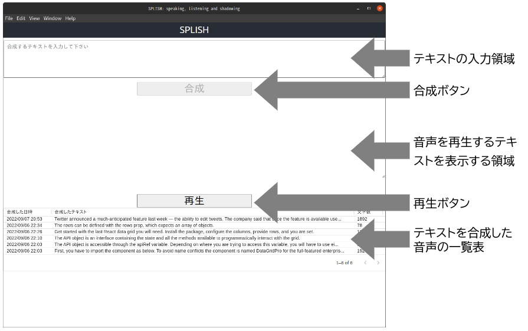
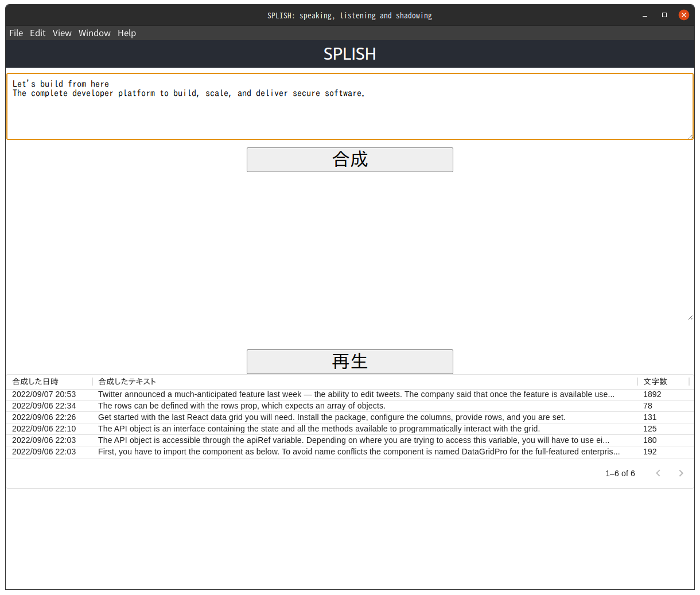
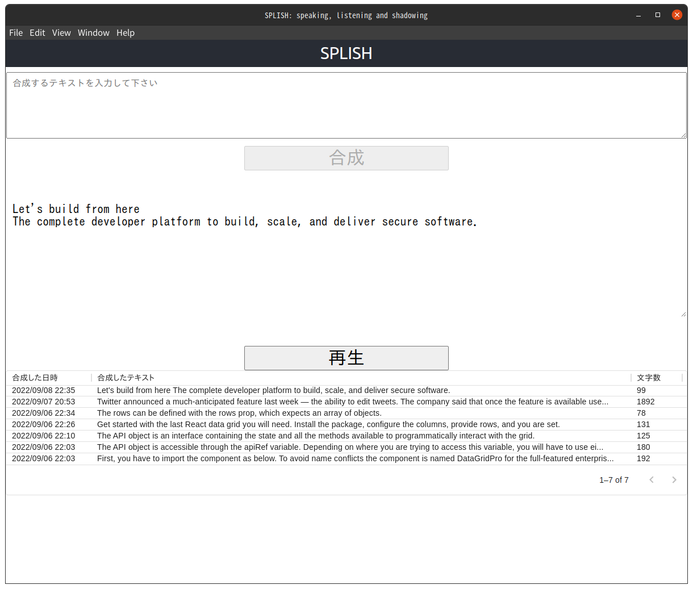

# SPLISH

SPLISH は、speaking と listening, shadowing の先頭の 2 文字づつを組み合わせた造語です。

## 目的

英語の上達、とくにスピーキングやリスニングにはシャドーイングという学習方法が有効だと聞いたことがあります。
splish はシャドーイングやパラレル・リーディングなどの学習方法をサポートするためのアプリケーションです。

wikipedia の[シャドーイングの項目](https://ja.wikipedia.org/wiki/%E3%82%B7%E3%83%A3%E3%83%89%E3%83%BC%E3%82%A4%E3%83%B3%E3%82%B0)によれば、学習する人のレベルにあわせた教材として、シャドーイングには音声、パラレル・リーディングには音声とテキストが必要です。現実には、自分の興味のある分野で、レベルにあった教材を入手することは、なかなか簡単ではありません。一方で英語のテキストは、インターネットに無数にあります。自分の興味のあるテキストから音声を合成できれば、教材を用意できることになります。

そこで、Google の [Text-to-Speech: 自然な音声合成](https://cloud.google.com/text-to-speech)を利用して音声を合成することを考えました。Google の Text-to-Speech は、1 ヶ月に 100 万文字、あるいは 400 万文字までの無料枠があります。個人の学習目的であれば、かなりの文字数だと思います。また無料枠を越しても、標準音声であれば 100 万文字ごとに$4 です。詳しくは[料金表](https://cloud.google.com/text-to-speech/pricing)を確認して下さい。

なお Text-to-Speech の英語の発音がどの程度まで正確なのかは私には判断できません。[デモ](https://cloud.google.com/text-to-speech#section-2)で日本語の発音を確認したところ、違和感がないわけではありませんが、目をつぶることにしました。

## 機能

splish には、以下の機能があります。

- 入力したテキストから音声を合成します。合成した音声はローカル環境に mp3 形式のファイルとして保存します。
- 合成した音声を再生します。再生するときにテキストの表示、非表示を切り替えられます。テキストを表示した場合にはパラレル・リーディング、テキストを表示しない場合にはシャドーイングを想定しています。

## 開発環境

Electron ベースで開発しています。開発及び検証している環境は、Linux(Ubuntu 20.04)です。開発にあたっては[Create React App(typescript)をベースに electron 環境を構築する](https://zenn.dev/niwaringo/articles/af693596ef948e)を参考にしました。

## 使い方

splish を利用するためには、

- Google API を利用するための設定
- アプリケーションのビルド

が必要です。以下の説明は linux 環境を前提としています。

### Google API を利用するための準備

#### 1. プロジェクトを作成します

[Google Cloud のコンソール](https://console.cloud.google.com/)でプロジェクトを作成します。

#### 2. Text-to-Speech の API を有効にします

作成したプロジェクトで Text-to-Speech の API を有効にします。

#### 3. サービスアカウントとして認証します

[サービス アカウントとして認証する  |  Google Cloud](https://cloud.google.com/docs/authentication/production?hl=ja#create_service_account)に書かれている手順に従って、サービスアカウントとサービスアカウントキーを作成します。

#### 4. 環境変数を設定します

サービスアカウントキーをダウンロードしたファイルを環境変数(GOOGLE_APPLICATION_CREDENTIALS)に設定します。

### ビルドの手順

リポジトリをクローンしてビルドします

```sh
> git clone git@github.com:kubotama/splish-cra.git
> cd splish-cra
> yarn electron:build:portable
```

dist/linux-unpacked/splish-cra がビルドされます。

### 操作方法

#### 1. splish を起動します

```sh
> dist/linux-unpacked/splish-cra
```

splish の画面が表示されます。



#### 2. テキストの入力領域に音声を合成したいテキストを入力します

テキストの入力領域にテキストが入力されると、合成ボタンが有効になります。サンプルの英文には GitHub の[About ページ](https://github.com/about)の先頭に書かれているテキストを利用しています。



#### 3. 合成ボタンをクリックして音声を合成します

合成ボタンをクリックすると音声を合成します。テキストの入力領域がクリアされて、代わりに音声を合成したテキストを表示する領域に表示されます。音声が合成されると再生ボタンが有効になります。



#### 4. 合成した音声を再生する

再生ボタンをクリックすると合成した音声を再生します。

#### 5. テキストを読めなくする

音声を合成したテキストを表示する領域をクリックすると、背景色が文字の色と同じになって、テキストが読めなくなります。もう一度クリックすると戻ります。


